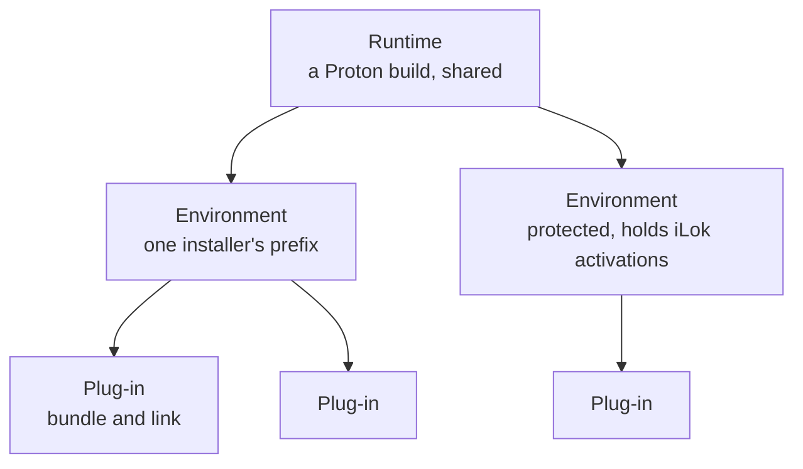
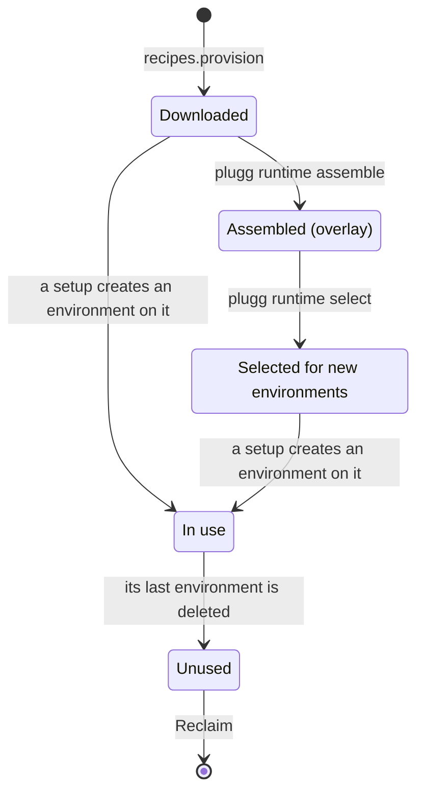
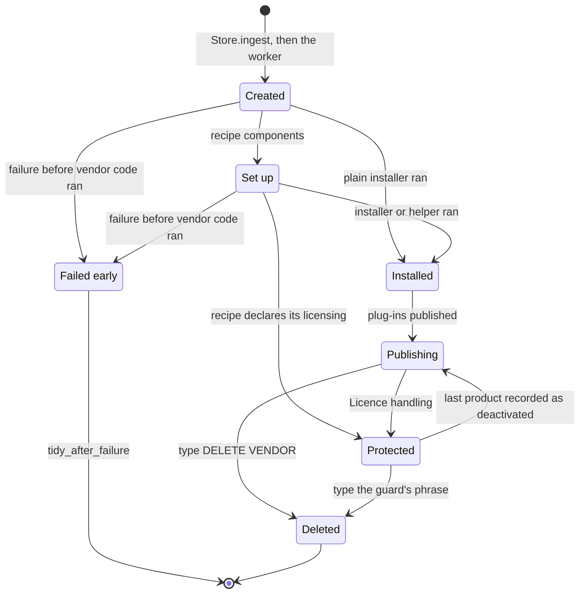
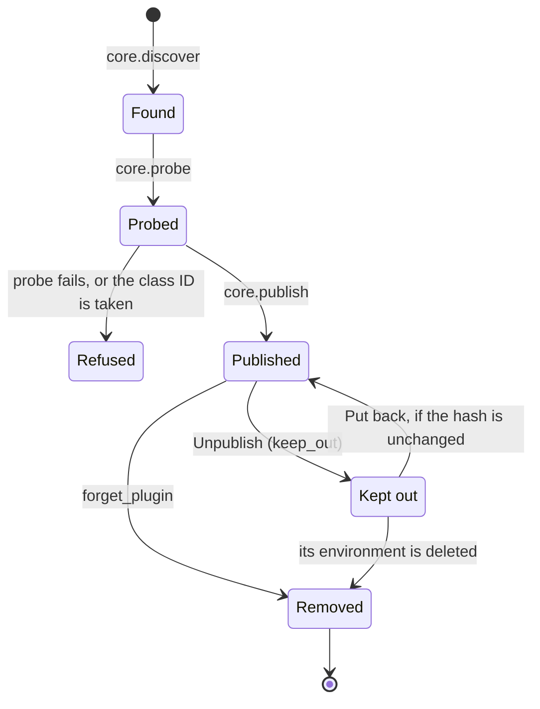
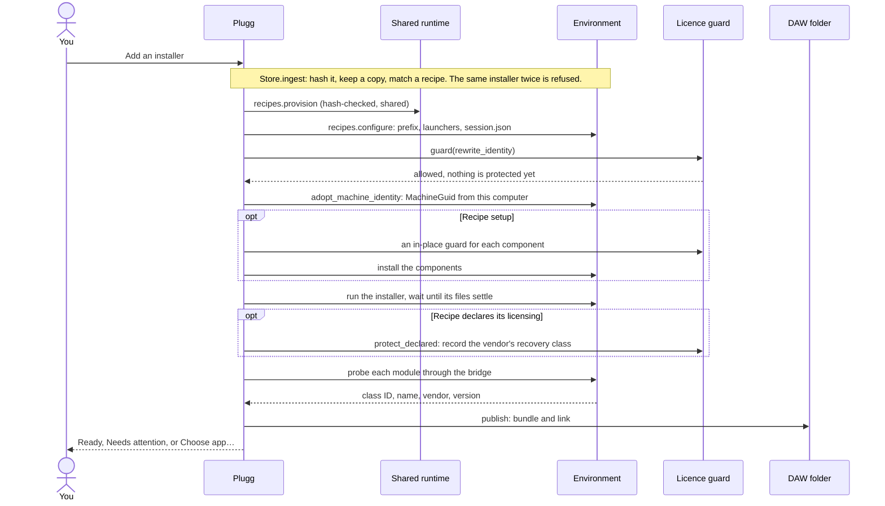
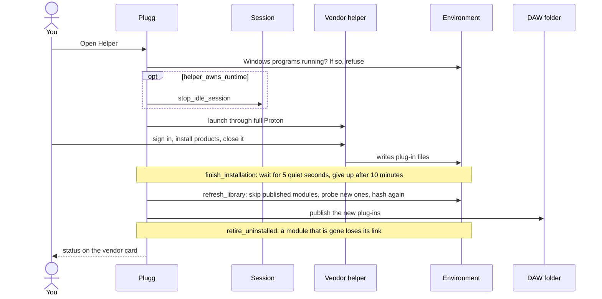
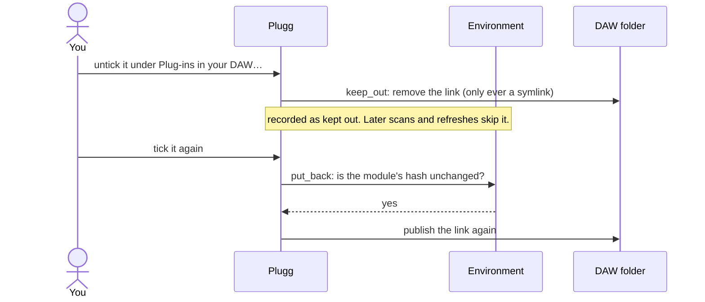
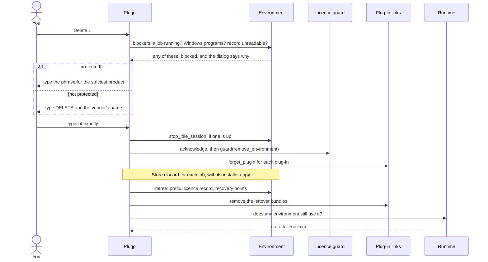

# Lifecycles

This page follows Plugg's three layers from the moment something is added until it is removed, and marks where the licence guard is asked. It is for contributors. Code is referred to by function name rather than line number, so search for the name.

## Three layers

- A **runtime** is a Proton build under `runtimes/`. Every environment created on it shares it.
- An **environment** is one directory under `environments/<id>`: the Wine prefix, its launchers, `session.json`, and `licensing.json` when it is protected. Every installer gets a new one. The only reuse is Softube Central or UA Connect joining the existing iLok environment.
- A **plug-in** is a bundle under `bundles/` plus a symlink in `~/.vst3/plugg`, or in `~/.vst/plugg` and `~/.clap/plugg` when those formats are published. Inside the bundle, the Windows module is a symlink into the prefix.

Deleting a layer never deletes the layer above it. A runtime is only removed when you reclaim it.

## Runtime

- `recipes.provision` downloads UMU-Proton, pinned by SHA-256, into `runtimes/proton-<hash>`. If it is already there, it is verified and reused.
- `runtime_overlay.assemble` builds an overlay such as `plugg-1` by hard-linking the base and swapping in the patched Wine modules. `select_for_new_environments` records it in `settings.json`. Existing environments keep the runtime they were created on.
- `recipes.configure` binds an environment to a runtime. If `session.json` already names a different one, it calls `guard('replace_runtime')`.
- **Reclaim** (`environments.remove_runtime`) is offered only for runtimes listed by `unused_runtimes`: no environment names it in its session record or launchers, and it is not selected for new environments. It needs no confirmation and no guard. The base runtime comes back through `provision` the next time a setup needs it. An overlay needs `plugg runtime assemble` again.
- **Sessions.** `proton_session.ensure_session` starts one persistent session per environment when the first plug-in loads. The session exits after `idle_seconds` (300) with no clients. `stop_idle_session` stops it on demand: before a vendor helper that needs full Proton opens, on Force close, and before an environment is deleted.

## Environment

- **Created.** `Store.ingest` hashes the installer, copies it into `jobs/<id>/payload` and matches it against the recipes. The worker (`core.work`) provisions the runtime, and `recipes.configure` writes the launchers and `session.json`. `licensing.adopt_machine_identity` then sets the prefix's `MachineGuid` from this computer's `machine-id`. It calls `guard('rewrite_identity')`, which passes because nothing is protected yet.
- **Set up.** A recipe's components (VC runtime, PowerShell, archive tools, the helper launcher) each call an in-place guard before they write.
- **Installed.** The installer runs through `launch-full-proton`. Plugg waits until the list of discovered modules stops changing.
- **Failed early.** Every setup records its stage in a journal: `helper-setup.json` for recipe helpers, `import-state.json` for imports, `setup-stage.json` for plain installers and Klevgrand. `environments.worthless` accepts a failed environment for removal only when its stage is in `NOTHING_INSTALLED_YET`, and it has no licence record and no published plug-in. The iLok setup keeps its environment.
- **Protected.** `licensing.json` beside the prefix. A recipe that declares `[licensing]` records it during setup through `protect_declared`, before any activation exists. Anything else is protected only once you record products under Licence handling (`licensing.protect`). Protection is not the default, on purpose. Most products can be activated again, and iLok's Report as Unusable recovers a lost machine, slowly.
- **Deleted.** See [deleting an environment](#deleting-an-environment).

## Plug-in

- `discover` walks `drive_c` for the formats the library publishes (`formats.enabled`). It skips symlinks, and for VST2 and CLAP it only takes 64-bit modules.
- `probe` loads each module once through the patched yabridge, inside the environment's session, and reads its class IDs, name, vendor and version. It refuses a VST2 shell and a VST2 plug-in without a unique ID.
- `publish` refuses a class ID that another ready plug-in of the same format already holds. It stages the bundle, renames it into `bundles/` and links it.
- A plug-in is removed by `forget_plugin`, called by `plugg forget`, when its environment is deleted, and by `vendors.retire_uninstalled` when a helper refresh finds its module gone.
- A refresh that finds a module with a different hash reports it and does not republish it.

## The licence guard

`licensing.guard(environment, operation)` sorts operations into three classes. An environment with no licensing record, or one that is not protected, passes every check.

| Class | Operations | On a protected environment |
| --- | --- | --- |
| `READ_ONLY` | `scan`, `publish`, `launch`, `open_helper`, `stop_session`, … | Always allowed. |
| `IN_PLACE` | `install_component`, `install_helper`, `install_vc_runtime`, `configure_graphics`, `update_launcher`, … | Allowed while the identity matches its record, or with an acknowledgement. |
| `IDENTITY_CHANGING` | `rewrite_identity`, `replace_runtime`, `remove_environment`, … | Refused without an acknowledgement. |

An acknowledgement is `licensing.acknowledge` with the phrase for the environment's strictest product. It names one operation, expires after two hours, and the guard uses it up the first time it accepts it. The guard refuses an operation name it does not know, so a new operation that writes inside a prefix has to be added to one of the three sets. [Licensing safety](licensing-safety.md) has the user-facing side.

## Adding a plug-in from an installer

If the installer left exactly one program that is clearly the vendor's manager, `core.adopt_installed_helper` makes it the environment's helper (`vendors.adopt_helper`). If it is unsure, the card offers Choose app… instead. `vendors.installer_apps` decides which programs count.

## Adding plug-ins through a vendor helper

No guard is called on this path. Opening a helper, scanning and publishing are read-only, so they also run on a protected environment. `vendors.start` refuses while Windows programs run in the prefix, and `vendors.work` checks again under `helper.lock`. Refresh library runs the same scan without opening the helper.

## Unpublishing and putting back

No guard is called, because the prefix is not touched. The bundle stays, so putting it back does not probe again. From the command line these are `plugg unpublish` and `plugg republish`.

## Deleting an environment

Deleting is only in the app. The CLI has no delete command. `environments.removal_phrase` picks the phrase: a protected environment asks for `I HAVE DEACTIVATED THIS ENVIRONMENT` or `I ACCEPT LOSING A LIMITED ACTIVATION`, and anything else asks for `DELETE` and the vendor's name. `environments.remove` checks the phrase and the blockers again. It stops the idle session before recording the acknowledgement, so a session that will not stop does not use up the typed phrase. A link into another library is only unlinked.

## What each removal takes away

| Action | Function | DAW link | Bundle | Installer copy | Environment | Guard |
| --- | --- | --- | --- | --- | --- | --- |
| Unpublish | `core.keep_out` | removed | kept | kept | kept | no |
| Forget a plug-in | `core.forget_plugin` | removed | kept | kept | kept | no |
| Dismiss an install | `Store.discard` | — | — | removed | kept | no |
| Delete an environment | `environments.remove` | removed | removed | removed | removed | `remove_environment` |
| Reclaim a runtime | `environments.remove_runtime` | — | — | — | only when none uses it | no |

Only deleting an environment can cost an activation, so it is the only removal that asks the guard.
